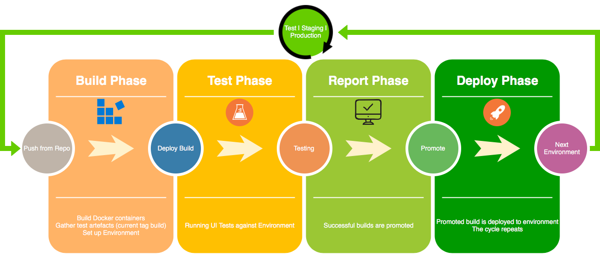
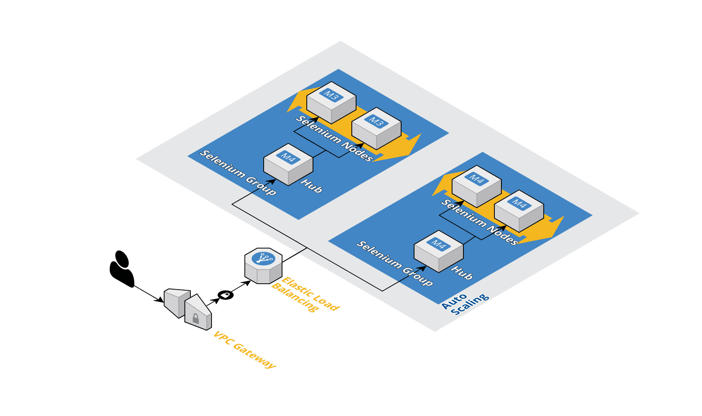
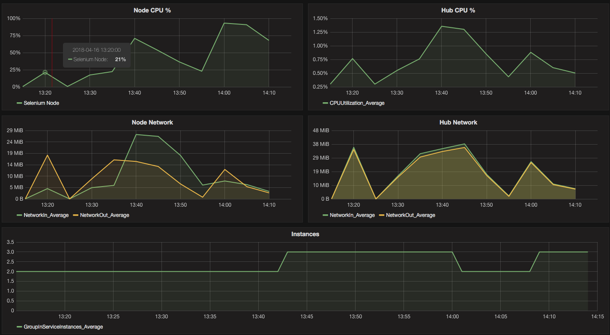
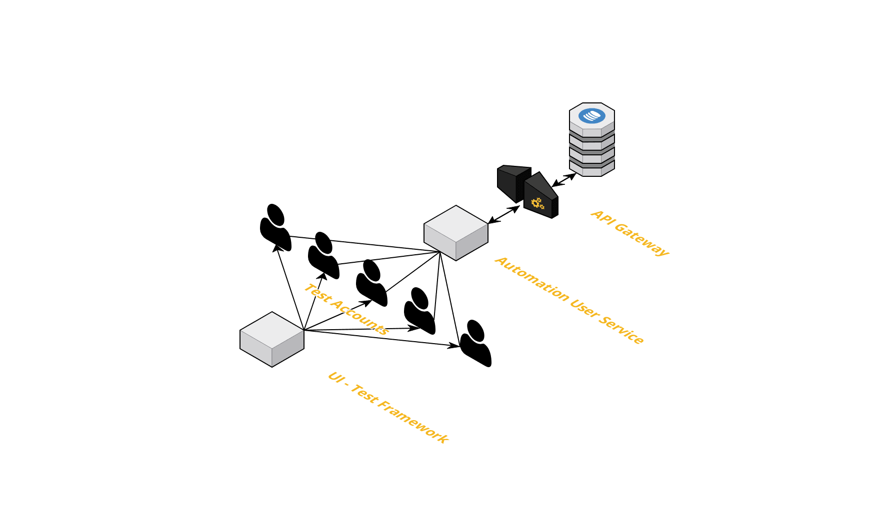
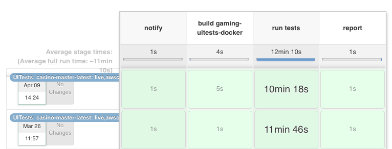
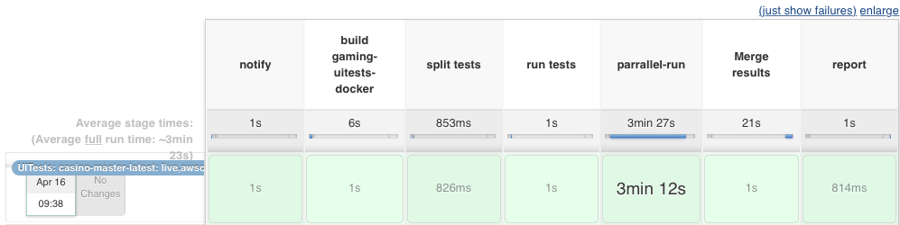
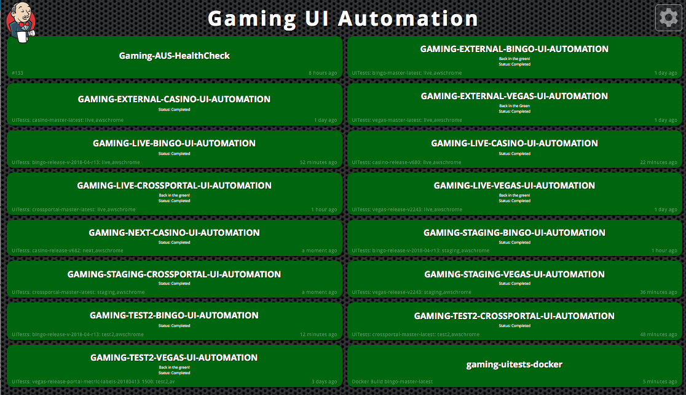

---?image=img/data-centre.jpg&opacity=10 
## Scaling UITests <br> @size[0.5em](with AWS & Docker)

<br><br>
### Chris Bellamy

Note: introduce myself, Been a Software Engineer in Test for 4 years. Worked at Sky Betting And Gaming for what will be 2 years in may. 
---

# The Beginning

* Disparate testing efforts
* Intermittent runs (if at all)
* Not run as often as they should be
* Maintained even less than that

Note: when I first came to Sky the situation with regards to testing was a lot of tedious manual regression testing, there was a few automation projects of varying levels of maturity. Some of these have matured into being part of the regular process such as the automated compliance testing among others. Some never really got off the ground. 
---

# The Problem

* Multiple products with different codebases
* Frequent releases (several times per day)
* Regression, Regression, Regression
* Tedious repetitive manual testing

Note: Partially the reason for this was because of the sheer amount of code coverage needed, several seperate portal projects with different codebases and a lot of tedious manual regression testing that was required for each test. Meant not all scenarios could be covered, meant bugs and regressions slipped through the cracks.  

---

So how can we help testing go from this:


To... 

---


---

## Automate!

@size[0.25em](That's why you're here right?)

---


## How hard could it be?

---
### Test Automation Accelerator
### AKA If you build it they will come

Requirements:

* Product teams have to own it
* Need buy in from the teams
* Automatic
* Visible

Note: I don't need to tell you the virtues of automation. The problem comes when trying to maintain ui-tests across a bunch of portals or just one particularly large project. You end up chasing your tail and you can't keep up. That's why it's important to sell the benefits of automation and get buy in from the engineers on the team. Providing tools that are easy to use for them to create their own tests as they go means the tests grow with the product rather than trying to catch up forever. 

---

## Shim it!

* Take an existing framework and extend it
* Add cross-product functions:
  * Logging in
  * Getting test users
  * Asserting 
  * Portal navigation
* Configuration
* Bootstrapping

note: explain a software shim : Like what twitter bootstrap is for basic website interface design. Create a group of functionality to make creating UI Tests easy and straight forward for developers to create as they build out features in the portal. Important that this functionality is generic enough to work across all portals, including portals that may not exist yet, but powerful enough to do what we need. 

---

### Enter Gaming-Codeception

Built on top of Codeception - a BDD-ish Automation framework in PHP

Can be referenced across each portal codebase 

Functions inside Gaming-Codeception are updated across all ui-test projects

...

---

Functions to smooth the process of UI-Testing:<br>
* Such as:
  * Handling cross origin (due to quirks of the gaming-portal implementation) (HAX!)
  * Handling window navigation (into and out of games)
  * Setting up testing sessions
  * Mobile device specific functions
  * Getting test accounts or create accounts for test and staging environments
  * Configuration switching for environments

note: 
Handling Cross origin: iframe navigation when you're jumping from one domain to another causes selenium to get upset. To Selenium it looks like XSS or Cross Origin Request Forgery so we have to 'massage' that situation into behaving.
Handling window navigation: We need to keep track of windows that have opened and jump in and out of game windows and verify the state of the portal
Setting up testing sessions: Setting cookies/headers to avoid AB Tests which can ruin our test runs 
Mobile device specific: Changing device orientation, working out what platform we're on (android/ios and how that affects what we can do in the device)
Configration switching for environments: We can set up new environments very quickly, configuration service handles the environment switching, you just provide a YAML file and we are quite detailed with what stuff we need in order for that to work. 

---

## Dependency inversion

Ask don't tell <br><br>

Screenplay/Actor Pattern <br>
Page Object patterns

Note: Gaming-Codeception doesn't know anything about the portal. Portals are responsible for providing that data. Navigation logic is abstract in Gaming-Codeception, describes a flow and is dependent on the portals to provide that concrete implementation. That way as changes to the portal are made we don't need to make changes to gaming-codeception that could affect other portals.
Actors (acceptance tester in the following example) perform generic actions following a test script. The underlying test code can change but the tests remain the same. 

---

#### Gaming-Codeception : Account.php 

```
    public function logInOnDesktop(
        SideBarInterface $sideBar = null, 
        TopBarInterface $topBar = null
    ){
        $sideBar = $this->checkSidebar($sideBar);
        $topBar = $this->checkTopbar($topBar);

        $topBar->openSidebar('login');

        $sideBar->focusOnSidebar();
        $sideBar->fillInLoginForm();

        //switch back to parent window as sidebar closes
        $this->switchToIFrame();
    }
```
Note: This method performs log in. Uses the Top bar and sidebar objects from portal. Is an abstract representation of flow, so if flow changes this can update without portal needing to change (as long as the components don't change)

+++

```
interface SideBarInterface
{
    public function focusOnSidebar();
    public function fillInLoginForm();
    public function navigateToSidebar();
    public function fillInLoginFormOnMobile();
    public function fillInDepositForm();
    public function fillInPromotionCode();
    public function clickLogout();
    public function closeSidebar();
    public function acceptTerms();
    public function registerForm1();
    public function registerForm2();
    public function registerForm3();
}
```

+++

```
interface TopBarInterface
{
    public function openSidebar($location = 'login');
    public function getMyBalance();
    public function getLoginButton();
    public function getRegisterButton();
    public function getDepositButton();
    public function getBalanceElement();
    public function getMyAccountButton();
}
```

note: as long as the sidebar and topbar objects meet this interface then they will work with our generic implementations inside gaming-codeception

+++

```
//Sidebar.php
public function fillInLoginForm()
{
    $user = Storage::getItem('user');

    $I = $this->getTester();

    // Fill in login form
    $I->waitForElementVisible('#username');
    $I->fillField('username', $user['username']);
    $I->fillField('pin', new PasswordArgument($user['pin']));
    $I->click('Log in');
    $I->waitForElementNotVisible($this->getFrameIdSelector(), 10);
    $I->waitUntilNavigationFinished();
}
```
Note: Sidebar contains the concrete method for loginform a long with several other sidebar specific functions. Contains selectors for the individual components. This way if the portal-specific sidebar changes this can be changed in the same codebase and all the tests are happy. 

---

This pattern makes writing tests easier and more maintainable

```
    public function successfulLogin(
        AcceptanceTester $I, 
        VegasPortal $portal
    ){
        $I->wantTo('Login to the site successfully using verified credentials');

        $I->amOnTheHomePage();
        $I->haveAnAccountOfType('verified');
        $I->logIn();

        $topBar = $portal->Topbar();

        $I->canSeeElement($topBar->getMyAccountButton());
        $I->cantSeeElement($topBar->getLoginButton());
    }
```
Tests are written as actions that an Actor follows. 
Tests don't know the implementation of the portal.  

note: 
There's plenty of resources about page object and actor pattern. I've put some links at the end of this presentation.   

---

Now we have several portals all with a good number of tests implemented
<br>
How do we get people to run these tests?

---
### What we do

We use Jenkins and Docker

Every time a release is pushed it creates a tag which triggers our UI-Tests-Docker-Build Job

This Job creates a docker image containing the current build along with all tests and the boot strapping to run those tests

note: we went down the docker and jenkins routes, but that is by no means the only solution to this problem. We found putting them somewhere a lot of people have access to them and were visible worked best for us.

---

## Continous Integration Flow



Note: buildphase: portal teams create a build after a passed code review. Kicks off uitest-docker-build job. This gathers the test artefacts such as the code under test (along with the actual uitests for that branch). Create a docker image with the test runner and tests plus other boot strap code required for reporting etc. This is then pushed to our Artifactory instance.
Test-phase: tests are run against the environment under test, starts with Test then staging and then finally production for most portals, with some 
exceptions
Reportphase: Generate the reports which show any failures or a 100% passed ui-test :thumbsup: 
Deploy Phase: This build then gets promoted and deployed to the next environment in the chain and the cycle repeats until we have a release on live. Due to the nature of building a tagged docker image 'snapshot' we can have simultaneous releases on the same portal going if we are really pushing it and they won't overlap. 
---

## Running Tests

Tests Run against AWS Selenium-Grid (or local for dev purposes) <br>
Config Service in Gaming-Codeception makes changing environment and selenium easy

Note: Passing different environment variables into test client can allow us to target any environment or selenium config conbination as needed such as Appium devices, Chromedriver, selenium grid, FF-Driver etc. 

---

### Configuration of the system

We can provide a YAML file to describe test browser/device instances 

note: Portals can set up their own URLs for their environments and gaming-codeception will just use that. New environments are easy to be extended just requires an update to their urls/application json files in the portal. 

+++

#### Chrome
```
modules:
    config:
        WebDriver:
            browser: 'chrome'
            connection_timeout: '600'
            request_timeout: '600'
            window_size: '1920x1080'
            log_js_errors: 'true'
            wait: '10'
            capabilities:
                browserName: 'chrome'
```

+++

#### iPhone
```
modules:
    config:
        WebDriver:
            host: 0.0.0.0
            port: 4723
            browser: safari
            capabilities:
                bundleId: 'com.bytearc.SafariLauncher'
                platformName: 'iOS'
                deviceName: 'iPhone 8'
                platformVersion: '11.0.0'
                udid: 'fdd852400e64bd61497fbeea26d5508139056a00'
                fullReset: true
```

+++

#### Saucelabs
```
modules:
    config:
        WebDriver:
            host: '%saucelabsuser%:%saucelabspw%@ondemand.saucelabs.com'
            port: 80
            browser: chrome
            capabilities:
                platform: 'Windows 10'
```

---

#### Selenium Grid AWS Architecture



Note: Consumers of the grid come in through the VPC (virtual private cloud) and need to authenticate with the service. Then this request goes through the load balancer. Based on cloudwatch metrics if the CPU usage for a node goes above 60% that triggers the autoscaling group to start firing up new nodes. There are always 2 instances of the grid available by default during office hours. Each selenium grid is an auto scaling group and as load on the system increases these groups increase in number. Each running test hits the hub and is assigned a node to perform the test on, once the test has complete that frees the node up for the next test. These could be from the same test run or adhoc tests.

---

### Reporting Selenium Grid Autoscaling


note: you can see that the node CPU usage hit 60% and the grid began scaling at the same time (bottom graph) then as usage dropped down it began to scale back. 

---

## Handling concurrency of runs

* Finite number of test users for testing on live. Not possible to mock
* Handling 1000s of tests a day
* Test User collisions are likely

Note: Due to the nature of testing on live, we need test users, these users need to be able to ensure state for the test to be valid. You don't want to be testing a deposit with one account when another test process is withdrawing funds from that same account. High number of tests, many concurrent, requires some sort of solution in order to ensure that we don't have account collisions giving us erroneous validated results

---
### Automation User Service

* Serverless Architecture
* Handles the serving of globally non-locking Test Accounts to running test processes
* Also drives the Test Account Health check service

Note: The AUS is hosted in AWS, based on a dynamodb behind an API Gateway. So it's serverless. I'll go into more details on the next slide. Accounts get locked globally as an account is requested. First come first served basis, as soon as a test run requests an account, that account is locked, for the duration of the test or if the test run fails or the test itself finishes prematurely for whatever reason, if this somehow doesn't unlock the account-lock, each lock has a Time To Live of 2 minutes. I'll talk more about the health check service in a bit. 

---
### AWS - AUS Cloud Diagram


Note: UI-Test framework polls the AUS service inside the framework, this makes a request to the APIGateway which will lock the account in the dynamoDB with a SHA256 hash, this hash is your key to unlock the account, if the lock is already in use then it returns false and the user service simply tries another account. This process takes fractions of a second as there's no actual servers to slow it down, it happens within milliseconds of the request hitting AWS. Due to the speed of this transaction that means we can have lots of tests running without collisions with only a small subset of accounts. Even then when we hit capacity it only causes test execution to pause for a couple of seconds on average. Because of this it's easy to scale. You just add more accounts to the pool. Simple. 

---

## Account Health Check Service

* Nightly build
* Verifies that test accounts are in a usable state
* Locks accounts that fail
* Returns a report detailing which accounts have failed and for what reason

note: 
 Test Account Health Check service runs nightly and vets each account used in automation. It checks that these accounts can log in and be used, it will flag up in a report whether these accounts are simply locked, expired, need details updating, all myriad of invalid account status. This way we can guarantee that when you lock an account for a test that that test is usable from one test to the next. It also returns a report detailing which accounts have failed and for what reason so that consumers of the service can either manually rectify or get the account reset.

---
### Test runs

* UI Testing is slow. 
* Usually in serial, one test after the other


note:  The testing period has this at the top for a good reason. UI testing is slow but valuable. But there are things we can do to rectify that. Such as running tests that aren't mission critical (checking responsible gambling links work, feedback systems, other non-critical journeys) out of hours. We can also perform parallel runs. 

---

### Parallel Runs



note: Running as many tests in parallel as possible can reduce the time taken for a test run however it does introduce some complications such as collating the reports that are produced from the different threads. Luckily our output was straight forward JUnit XML and HTML so it was straight forward to rectify. I just made a couple of Go scripts that took the seperate test reports and merged them into a nice single output. This then just plugs straight into our Jenkins reports. 

---

### Reports

[HTML Report](https://platform-control.platformservices.io/view/Gaming%20UI%20Automation/job/GAMING-EXTERNAL-VEGAS-UI-AUTOMATION/178/HTML_Report/) <br>
[Junit Report](https://platform-control.platformservices.io/view/Gaming%20UI%20Automation/job/GAMING-LIVE-VEGAS-UI-AUTOMATION/404/testReport/)

---
### Dashboards



note: Put the running tests somewhere visible. We have the dashboard front and centre on a big screen in front of the service level managers and on a screen in every single portal squad area. Mainly so that people can come along and go "whys that thing red" and make somebody do something about it. Teams need to own it in order to make it go green. Everybody loves a nice green dashboard.  

---
##### Summary

* Product teams have to own it 
  * Make it Easy to write tests as features are built out!
* Need buy in from the teams
* Automatic
* Visible

note: So we covered how to get developer buy in. Hint: Make it easy for them and do that hard work up front so that it's easier to maintain and keep the automation train rolling.

---

#### Summary

* Product teams have to own it 
  * Make it Easy to write tests as features are built out!
* Need buy in from the teams
  * Make it easy to maintain and extend
* Automatic
* Visible

note: Get buy in from the team by showing the virtues of automation, and giving them a platform that they can make tests work quickly and easily

---
#### Summary

* Product teams have to own it 
  * Make it Easy to write tests as features are built out!
* Need buy in from the teams
  * Make it easy to maintain and extend
* Automatic
  * Create a CI Pipeline that triggers from every build with execution that can scale (selenium grid)
* Visible

note: Continous Integration pipelines that are triggered from a code being merged into a repos release branch means there's no effort for the development teams to run the tests. Turns out if you don't make it automate, chances are people aren't going to run it, just out of forgetfulness. 

---

#### Summary

* Product teams have to own it 
  * Make it Easy to write tests as features are built out!
* Need buy in from the teams
  * Make it easy to maintain and extend
* Automatic
  * Create a CI Pipeline that triggers from every build with execution that can scale (selenium grid)
* Visible
  * Put a dashboard somewhere. The bigger the better

Note: Put it in peoples faces, make sure people take not of failing tests and resolve the issues straight away. 

---
References:

http://serenity-js.org/design/screenplay-pattern.html
https://martinfowler.com/bliki/PageObject.html
https://aws.amazon.com/blogs/compute/automatic-scaling-with-amazon-ecs/